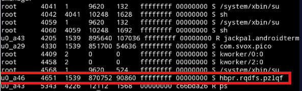

## Android 스미싱 분석  
  
Tool Download :

[Strings64 Tools Download](https://docs.microsoft.com/ko-kr/sysinternals/downloads/strings)   
  
  
[APK Studio](https://github.com/vaibhavpandeyvpz/apkstudio/releases)  
  
  
[Terminal Emulator](https://play.google.com/store/apps/details?id=jackpal.androidterm&hl=ko&gl=US)  
  
  
[LogCat](https://apkpure.com/kr/logcat-extreme/scd.lcex)
  
  
   
   
[그림 1] 설치 권한 여부 확인
     
  
해당 URL을 접속하게 되면 \[랜덤 값\].apk'라는 이름의 크롬 악성 어플 설치
파일 사용자 스마트폰에 저장된다
  
  

  
  
[그림 2] 악성 유사Chrome 어플 설치  

   
어플 설치 이후 실행하게 되면 런처 앱에서 아이콘이 사라지면서 상단 아이콘이 하나 상주하게 되면서 백그라운드 메모리에 계속 남게된다.   
  
  
  
  
[그림 3] 악성 유사Chrome 어플 실행   
  

어플이 설치된 이후에는 사용자 몰래 동작하면서 문자, 주소록, SD카드, 계정정보, IMEI(휴대폰고유식별번호) 등 개인정보를 포함한 스마트폰 주요정보를 공격자에게 모두 전송하게 된다.
  
   


---
## APK 분석
  


  

  
    
[그림 4] 피싱 크롬 악성 어플 취득 권한
  
  
**전화, 문자, 주소록, 인터넷 기록, 설치된 어플 정보, 와이파이 정보, 블루투스, 계정정보, IMEI(휴대폰고유식별번호)** 등 권한을 획득하는 것은 알게 되었다.   
  
  
  
  
  
[그림 5] 피싱 크롬 악성 어플 디컴파일  
  
  
그러나 해당 피싱 크롬 어플 디컴파일 후 소스 코드 분석 결과 코드가 난독화
되어있어 직접적인 분석은 불가능 하였다
  
  
  

    
[그림 6] 피싱 크롬 악성 어플 Logcat

  
조금 더 알아보기 위해 해당 악성 크롬 어플을 설치하여 실행 시킨뒤 Root 권한을 얻은 Logcat으로 로그를 조회 해본결과 [그림 6]과 같이 반복적으로 정보를 전달 하는 행위를 발견하였다.
  
빨간색 박스에 있는 곳 103.9.76.78 IP에 연결하여 정보를 전달하는 것을 발견하였으나 파란색 박스의 com.j\$c&\[\].a는 어떠한 정보를 의미하는지 파악하지 못하였다.


 
  
  
[그림 7] 크롬 악성 어플SetUID 조회
  
 
  
  
[그림 8] 크롬 악성 어플 메모리 덤프 시도

어떠한 행동을 하고 있는지 조사하기 위해 상주하고 있는 악성 어플을 Setuid 값을 찾아 메모리 덤프 하였다.   
   
    
   
  

[그림 9] strings 64 덤프 파일을 txt 파일로 변환

```
  am dumphep \[pid\] \[저장경로\]/\[파일명\].hprof
```

해당 dump파일을 PC로 옮겨 Strings라는 툴을 이용해 메모리에 담긴 내용을 얻을 수 있었다.  
  
  
    
  
  
[그림 10] 덤프 파일 텍스트 변환 후   
  
    
해당 내용을 분석 해본 결과 **위치, html view , 문서 기록, SMS 기록, 브라우저 기록** 등을 **공격자 (IP : 103.9.76.78, 103.9.76.95)**에게 전송하는 것을 확인할 수 있었다  


