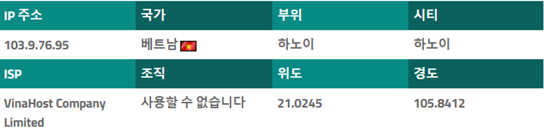
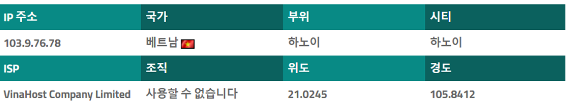
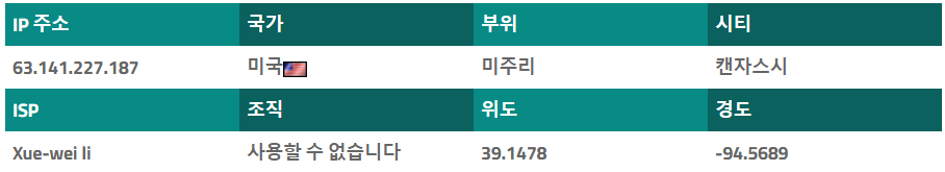

## 공격자(탈취자) IP 분석

분석한 공격자 IP주소 정보는 다음과 같다
  
       
[그림 1] 공격자 IP 주소103.9.76.95정보  
  
  
     
[그림 2] 공격자 IP 주소218.9.76.78 정보  
  
     
     
[그림 3] 공격자 IP 주소63.141.227.187 정보  

웹 로그를 조회 하여 의심가는 3개의 IP를 조회 해보았다. [그림 1] [그림 2] [그림 3] 참조.  
  
  
본 iplocation.net을 통해 조회한 접속한 결과로 베트남, 미국에서 행동들이 발견되었다.  
