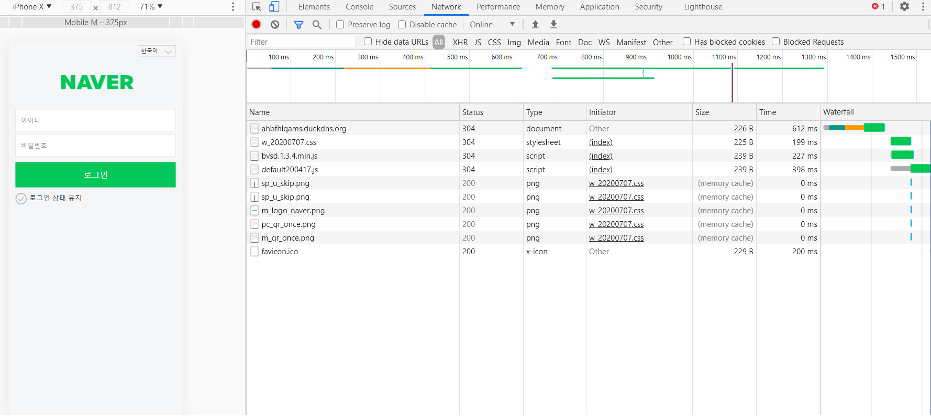

## ios 스미싱 (Web) 분석  
  
   
  

[그림 1] NAVER 피싱 사이트  
  
  
IOS의 경우 사용자가 어플 파일을 받아 설치가 불가능하므로 NAVER 피싱 웹 사이트로 유도하게 된다.  
    
  
     
[그림 2] NAVER 피싱 사이트 데이터 전송  
    
  
   
[그림 3] NAVER 피싱 사이트 데이터 전송    
    

웹 사이트에 접속하여 텍스트 필드란에 아이디와 비밀번호를 입력후 로그인 버튼을 누른 결과 정보 값은 전송 되었으며 Naver 아이디와 비밀번호를 탈취하게 된다.