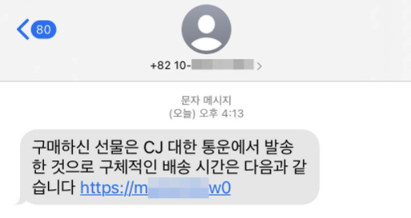
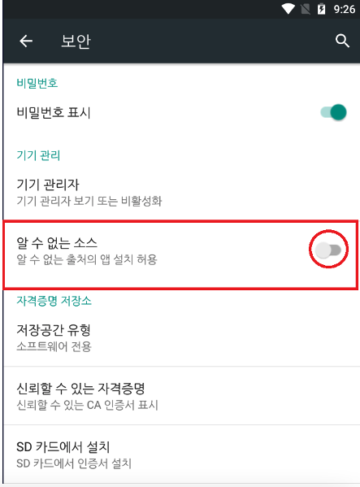

# 최근 SMS 스미싱 APK 분석 보고서

## 1. 취약점 개요

  

  

[사진1] SMS 스미싱 문자  
  
  
'구매하신 상품이 발송됐습니다' 등의 내용과 함께 URL이 포함된 문자 메시지를 보낸다.  
사용자가 해당 URL을 눌러 피싱 사이트로 접속하면 '더 나은 서비스 체험을 위해 한층 개선된 크롬 최신버전을 업데이트 하라'는팝업 메시지가 나타나며, 사용자가 '확인'을 누를 경우 '\[랜덤
값\].apk'라는 이름의 크롬 악성 앱 설치 파일 사용자 스마트폰에 저장된다.  
 

특히, 어플 아이콘 역시 정상 **크롭 앱과 동일하기 때문에 사용자가 가짜 파일인 것을 인식하기 어렵다.**   
스마트폰에 악성 앱이 설치된 이후에는 사용자 몰래 동작하면서 **문자, 주소록, SD카드, 계정정보, IMEI(휴대폰고유식별번호)** 등 개인정보를 포함한 스마트폰 주요정보를 공격자에게 모두 전송하게 된다.  
  

|No|S/W 구분|Version|비고|
|---|---|---|---|
|1|Android|전체 버전 해당| |
|2|IOS|전체 버전 해당| |
   
  
[표1] 영향 받는 소프트웨어 목록
  
---
  

## 2. 스미싱 분석  
  
  
|역할구분|OS|Version|비고|
|---|---|---|---|
|분석|Windows|10|NoxPlayer 사용|
|테스트1|Android|5.1.1|ROOT 권한|
|테스트2|Safari|None|Mobile-Iphone|
  
[표2] 테스트 환경 구성  

### 2.1 안드로이드 분석

[안드로이드 분석 바로가기](https://github.com/black9/Smishing-Analysis-Report/blob/master/Android_analysis.md)  
  
  
### 2.2 IOS (Web) 분석
  

[IOS (Web) 분석 바로가기](https://github.com/black9/Smishing-Analysis-Report/blob/master/Ios_analysis.md)  

### 2.3 공격자 IP 분석  
  
  
[공격자 IP 분석 바로가기](https://github.com/black9/Smishing-Analysis-Report/blob/master/IP_find.md)  
  

## 3. 대응방안

   
[그림 2] Android 알 수 없는 소스 화면  

스미싱 문자 예방

- 문자 수신 시 출처가 불분명한 사이트 주소는 클릭을 자제하고 바로 삭제 권고

- 의심되는 사이트 주소의 경우 정상 사이트와의 일치여부를 확인하여 피해 예방

- 휴대폰번호, 아이디, 비밀번호 등 개인정보는 신뢰된 사이트에만 입력하고 인증번호의 경우 모바일 결제로 연계될 수 있으므로 다시 확인 권고

- 번호 도용 문자 발송 차단

